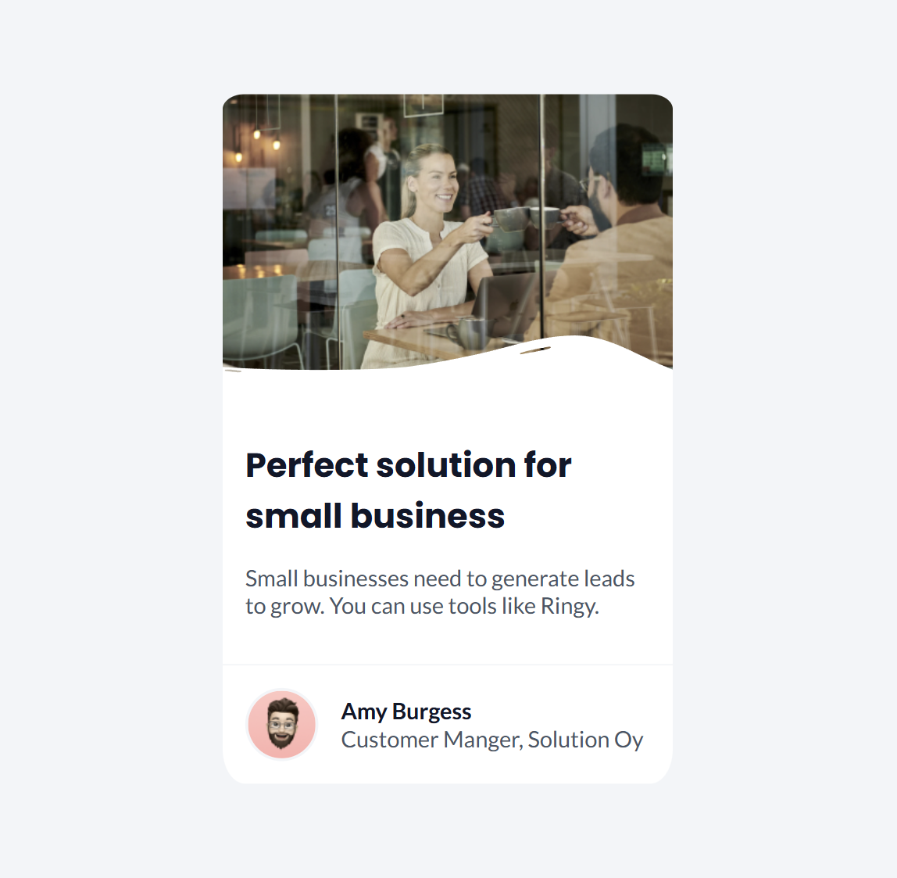
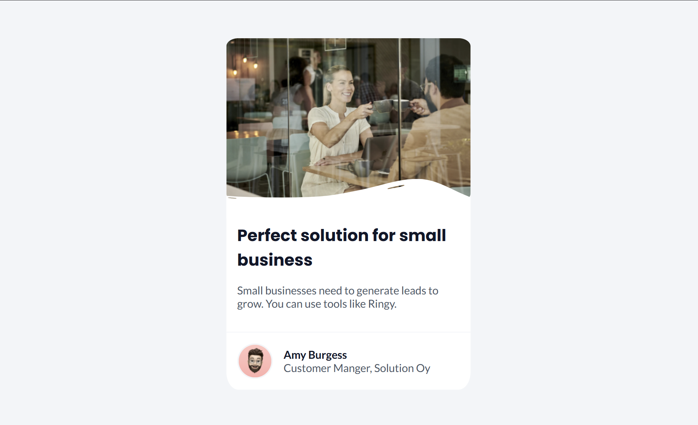
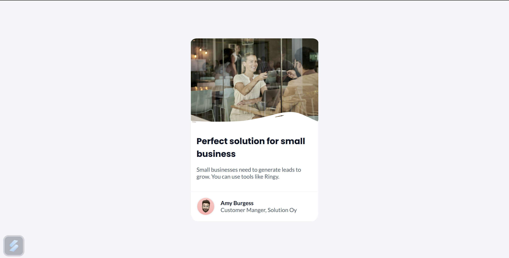

# Business Blog Card

This project is a responsive business blog card designed using HTML and CSS. The card displays a hero image, an overlay, title content, and a footer with an avatar and author information. It is styled with modern fonts and adaptive layouts to provide a clean and professional design.  


## 🖥️ Features
- **Responsive Design:** Adjusts to different screen sizes with media queries.  
- **Modern Fonts:** Utilizes the Lato and Poppins font families for a sleek appearance.  
- **User-Friendly Layout:** A simple, visually appealing layout suitable for blogs or business cards.  
- **Customizable:** Easy to modify with clear structure and organized CSS.

## 🛠️ Technologies Used
- **HTML5**: Markup language used to structure the content.
- **CSS3**: For styling and layout.
- **Google Fonts**: Font styling using the 'Lato' and `Poppins` font family.

## 🏗️ Project Structure
```
businessBlogCard/
|
+-- resources          # resources for webpage
+-- index.html         # Main HTML file
+-- style.css         # CSS file for styling
\-- README.md          # Documentation (this file)
```

## 🚀 How to Use
1. Clone the repository:
   ```bash
   git clone https://github.com//businessBlogCard.git 
2. Open the `index.html` file in your favorite browser.

## 📂 Folder Structure
- index.html: Contains the HTML structure of the Business Blog Card.
- style.css: Provides the CSS styling, flexbox layout, and media query.
- resources/: Folder for assets like images and overlat.

## 📝 Customization
1. Add your content to the `index.html` file under the relevant blog cards.
2. Customize styles by editing the `style.css` file.
3. Replace images in the resources/ folder with your own.

## 🖼️ Screenshot
### Mobile View

### Tablet View

### Dekstop View


